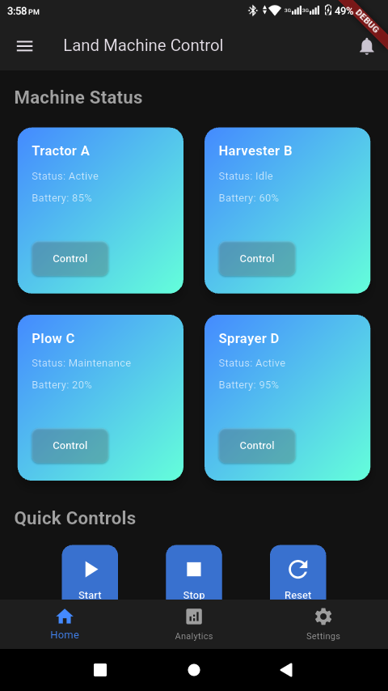
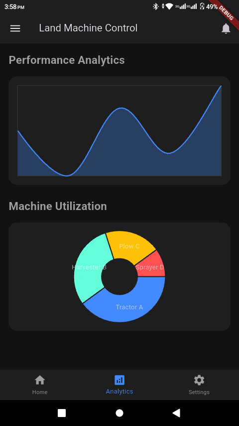
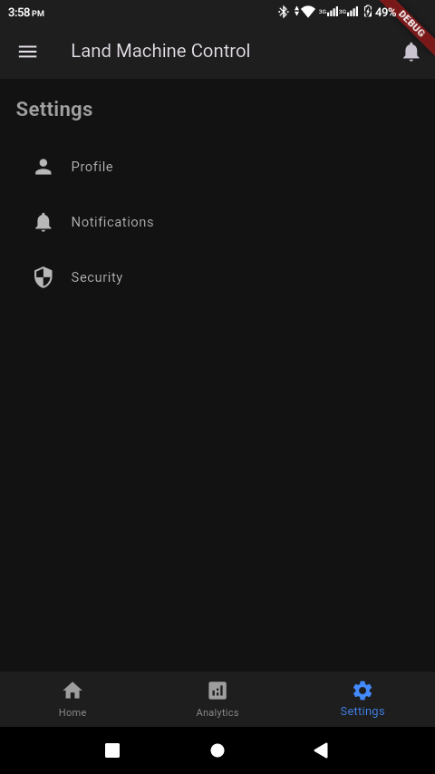
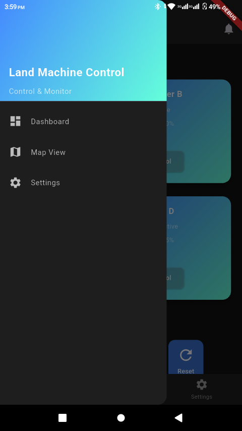
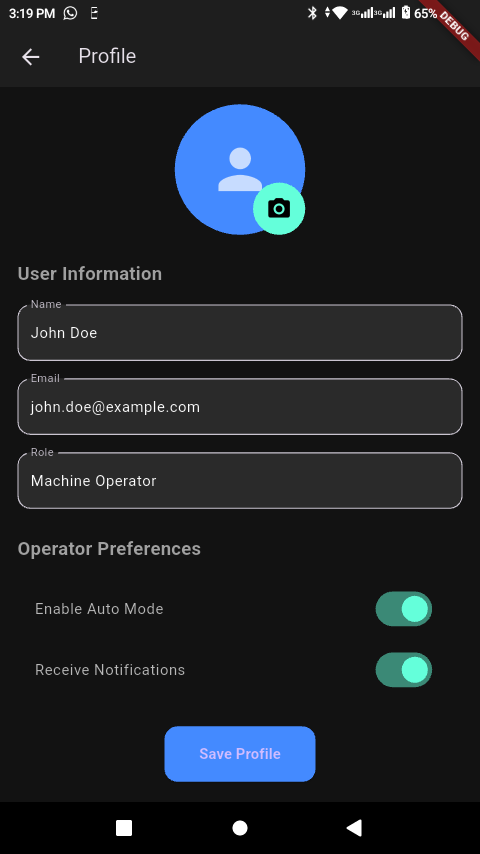
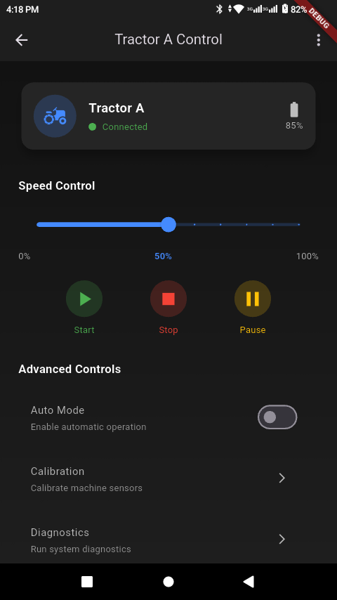

# modern_machines

Modern machines is a prototype sort of project built with the aim of achieving the control of machines remotely via the app.
It uses flutter framework for the development of the UI.

     

## Getting Started

Here is how to get started in cloning and running the project successfully.

            git clone https://github.com/Salvatore-droid/modern_machines

After cloning the project successfully. Open with vscode or android studio.

            cd modern_machines

Clean and download dependencies.

            flutter clean
            flutter pub get
            flutter run

